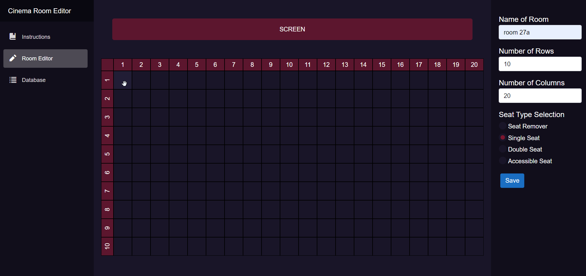
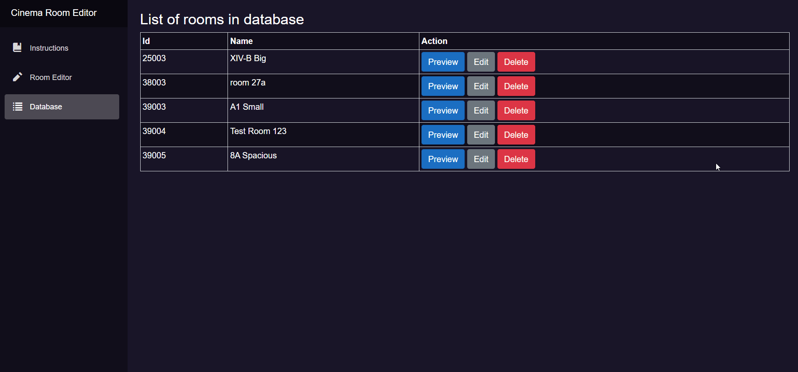

# What is Cinema Room Editor?
It's a CRUD web app which allows to manage layouts of rooms in your cinema

🛠 Developed using ASP.NET Core Blazor Server
# Demonstration of tool usage
 Demo gifs: 

           
Creating a room

           
         

 	

           
Previewing entry from database

           
         

